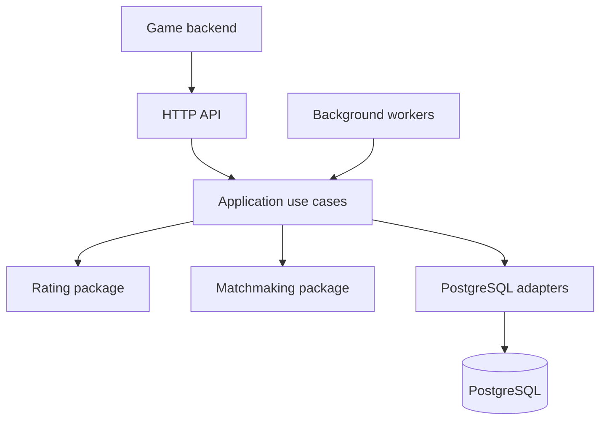

# Solitaire Matchmaking

Go service foundation for asynchronous, skill-based Klondike Solitaire
tournaments inspired by EasyWin Solitaire. The system will form rooms of five,
six or seven players while balancing two measurable goals:

- similar predicted chances of winning;
- short, consistently measured room fill times.

The current stage implements a versioned baseline rating model, bounded fair
room selection, deterministic retry decisions and reproducible simulation
workloads. The service process foundation provides configuration, PostgreSQL
connectivity, liveness, readiness and an authenticated capability endpoint.
Transactional tournament persistence remains a later stage.

## Architecture



`pkg/rating` and `pkg/matchmaking` contain portable domain contracts. They have
no HTTP, database or `internal` dependencies. The game backend remains the
authority for eligibility, deck generation, result verification, balance
reservations and settlement.

See [project map](docs/project-map.md), [architecture decisions](docs/architecture.md),
[data model](docs/data-model.md), [quality measures](docs/quality-metrics.md) and
[roadmap](docs/roadmap.md).

## Run locally

Requirements: Go 1.26 or later and PostgreSQL 18.

```bash
cp .env.example .env
docker compose up -d postgres
set -a
. ./.env
set +a
go run ./cmd/server
```

Generate a local token before starting the service:

```bash
openssl rand -hex 32
```

Use the generated value as `API_TOKEN`; do not commit it.

```bash
curl http://127.0.0.1:8080/healthz
curl http://127.0.0.1:8080/readyz
curl -H "Authorization: Bearer $API_TOKEN" \
  http://127.0.0.1:8080/v1/capabilities
```

## Verification

```bash
make check
make security
```

The current API is documented in [`api/openapi.yaml`](api/openapi.yaml). Planned
integration contracts are listed in [`docs/api-contract.md`](docs/api-contract.md).
