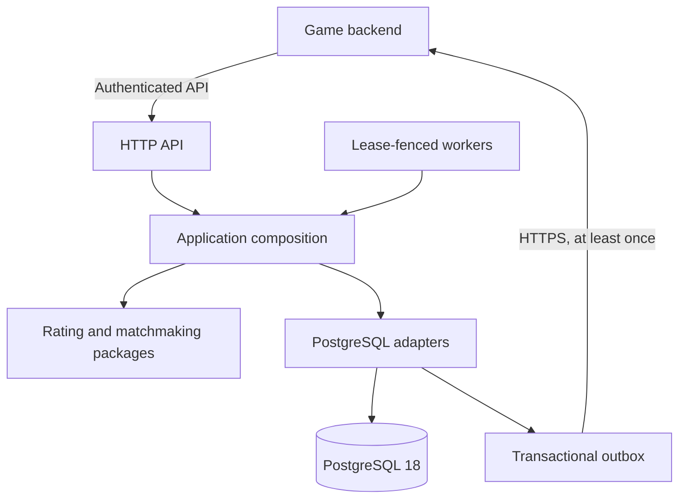

# Solitaire Matchmaking

[](https://github.com/krav01/solitaire-matchmaking/actions/workflows/ci.yml)
[](go.mod)
[](compose.yaml)
[](docs/release-checklist.md)

A production-oriented Go service for asynchronous, skill-based Klondike
Solitaire tournaments. It forms fair rooms of five to seven players, accepts
authoritative results, updates versioned ratings, and delivers durable events
to the game backend.

The repository is a release candidate and an engineering reference
implementation. Its synthetic workloads validate behavior and operational
trade-offs; they are not claims about production capacity or predictive
accuracy.

## What this project demonstrates

| Challenge | Implementation |
| --- | --- |
| Fair rooms without long waits | Immutable pre-game rating snapshots, hard whole-room fairness limits, bounded skill-window expansion, and deterministic age priority |
| Concurrent state transitions | PostgreSQL transactions, uniqueness constraints, short claims, database-time leases, and fencing tokens |
| Retry-safe commands | Stable idempotency identities for ticket acceptance, cancellation, and result finalization |
| Reliable integration | Transactional outbox, per-aggregate ordering, capped retry delay, and at-least-once HTTPS delivery |
| Governed rating changes | Versioned baseline and feature models, time-ordered holdout evaluation, segment checks, revision-fenced activation, and rollback |
| Operable releases | Structured logs, bounded-cardinality Prometheus metrics, dashboards, alerts, resilience tests, security review, and tag-gated GHCR images with SBOM and Sigstore attestations |

## Architecture



The game backend remains authoritative for identity, eligibility, deck
generation, result verification, reservations, and settlement. This service
owns room formation, tournament lifecycle persistence, rating updates, and
integration-event delivery.

The domain packages under `pkg/` have no HTTP, storage, or `internal`
dependencies. `internal/application` composes use cases and adapters; background
workers share those transaction boundaries instead of duplicating business
rules.

### Core invariants

- Matchmaking uses only information available before the player's current game.
- Fill speed cannot relax hard fairness limits or alter fee, capacity, or version
  compatibility.
- State transitions and their outgoing events commit atomically.
- Stale leases cannot acknowledge or overwrite work owned by a newer claim.
- Rating results are processed in availability order; missing features remain
  missing rather than becoming zero observations.
- External consumers deduplicate deliveries by `Idempotency-Key`.

See the [architecture decisions](docs/architecture.md),
[data model](docs/data-model.md), [matchmaking policy](docs/matchmaking.md), and
[rating model](docs/rating-model.md) for the detailed design.

## Lifecycle

1. The game backend persists an eligible entry and sends `POST /v1/tickets`
   with an immutable rating snapshot.
2. A bounded worker selects a fair room and atomically assigns its sessions.
3. The backend submits complete, verified standings through `POST /v1/results`.
4. Ordered rating processing persists history and current estimates.
5. The transactional outbox delivers committed lifecycle events to the backend.

Timeouts, duplicate requests, process restarts, stale claims, and publisher
failures are covered by deterministic unit and PostgreSQL integration scenarios.

## API surface

| Endpoint | Purpose |
| --- | --- |
| `GET /healthz`, `GET /readyz` | Process liveness and database readiness |
| `GET /metrics` | Authenticated Prometheus/OpenMetrics telemetry |
| `GET /v1/capabilities` | Implemented feature and release-stage discovery |
| `POST /v1/tickets` | Idempotently accept an eligible tournament entry |
| `GET /v1/tickets/{ticket_id}` | Read queue or assignment state |
| `DELETE /v1/tickets/{ticket_id}` | Cancel a queued ticket |
| `GET /v1/rooms/{room_id}` | Read room composition and lifecycle state |
| `GET /v1/ratings/{player_id}?mode_id=...` | Read the latest persisted, versioned rating |
| `POST /v1/results` | Idempotently finalize authoritative standings |

The complete inbound API and outbound webhook schema live in
[`api/openapi.yaml`](api/openapi.yaml). Integration semantics, retry decisions,
and event payloads are documented in the
[game-backend contract](docs/api-contract.md).

## Run locally

Requirements: Go 1.26.6 or a compatible newer release, Docker, and Docker Compose.

```bash
cp .env.example .env
# Replace both token placeholders with different values from: openssl rand -hex 32
docker compose up -d postgres
docker compose run --rm migrate
set -a
. ./.env
set +a
go run ./cmd/server
```

The service requires an HTTPS outbox destination, except for loopback
development. A runnable receiver with in-process deduplication is available in
[`examples/game-backend`](examples/game-backend/README.md).

```bash
curl http://127.0.0.1:8080/healthz
curl http://127.0.0.1:8080/readyz
curl -H "Authorization: Bearer $API_TOKEN" \
  http://127.0.0.1:8080/v1/capabilities
```

Configuration defaults and worker bounds are listed in [`.env.example`](.env.example).
The [deployment guide](docs/deployment.md) covers production secrets, TLS,
database roles, migration order, canaries, and rollback.

## Verification

```bash
make check       # tidy, build, race tests, lint
make security    # reachable Go vulnerability scan
```

For a release candidate, point `TEST_DATABASE_URL` at a disposable PostgreSQL 18
database and run:

```bash
make release-check
```

That gate adds migrations, lifecycle integration, load/recovery/failure
injection, container build, and non-root runtime-user verification. GitHub CI
also runs fixed-work fuzzing, architecture boundaries, dependency review, and a
critical matchmaking benchmark.

Migration-sensitive changes and a weekly scheduled workflow additionally create
100,000 representative rows in each primary operational table, make a PostgreSQL
custom-format backup, restore it into a separate disposable database, rerun the
migration binary, and compare data plus schema-object manifests. See the
[migration safety guide](docs/migration-safety.md) for the guarded local command.

A stable `vMAJOR.MINOR.PATCH` tag on a commit contained in `main` runs the
[release workflow](.github/workflows/release.yml). It repeats the release gate,
repeats the backup/restore rehearsal, scans the image before publication,
publishes it to GHCR, and records both build provenance and the SPDX SBOM as
signed attestations. The workflow publishes artifacts only; deployment remains
an explicit operator action.

## Repository guide

| Area | Location |
| --- | --- |
| Service and migration entry points | [`cmd/server`](cmd/server), [`cmd/migrate`](cmd/migrate) |
| Portable domain algorithms | [`pkg/matchmaking`](pkg/matchmaking), [`pkg/rating`](pkg/rating) |
| Lifecycle and worker orchestration | [`internal/tournament`](internal/tournament), [`internal/worker`](internal/worker) |
| HTTP and PostgreSQL adapters | [`internal/httpapi`](internal/httpapi), [`internal/postgres`](internal/postgres) |
| Versioned schema | [`migrations`](migrations) |
| Operations assets | [`deploy/observability`](deploy/observability), [`docs/deployment.md`](docs/deployment.md) |

Start with the [project map](docs/project-map.md) for responsibilities and the
[delivery roadmap](docs/roadmap.md) for completed and pending stages.
Engineering controls are defined by the [Definition of Done](docs/definition-of-done.md),
[testing strategy](docs/testing.md), [security model](docs/security.md), and
[release checklist](docs/release-checklist.md).

Contributions follow [CONTRIBUTING.md](CONTRIBUTING.md). Security concerns should
be reported according to [SECURITY.md](SECURITY.md).
