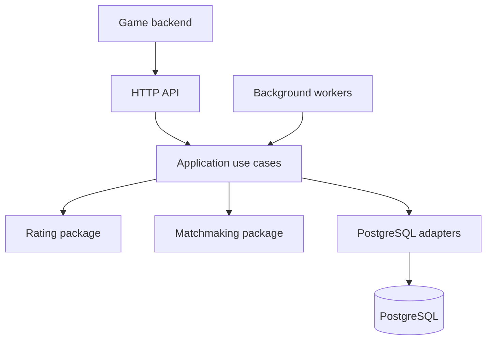

# Solitaire Matchmaking

Go service foundation for asynchronous, skill-based Klondike Solitaire
tournaments inspired by EasyWin Solitaire. The system will form rooms of five,
six or seven players while balancing two measurable goals:

- similar predicted chances of winning;
- short, consistently measured room fill times.

The current stage implements a versioned baseline rating model, bounded fair
room selection, deterministic retry decisions and reproducible simulation
workloads with joint speed, timeout and fairness reports. The service process
foundation provides configuration, PostgreSQL connectivity, liveness, readiness
and an authenticated capability endpoint. Transactional persistence now covers
versioned migrations plus idempotent ticket acceptance, cancellation and atomic
room assignment. A bounded, lease-fenced worker now performs fair room selection,
fast stale-room retries and transactional ticket expiry. The authenticated result
endpoint validates complete authoritative standings and atomically completes a
room; a bounded deadline worker expires rooms that never receive a timely result.
A lease-fenced rating worker processes verified results in availability order and
atomically persists rating history, current estimates and `result.rated` outbox
events. A bounded outbox worker now publishes committed events to the game
backend with aggregate ordering, fenced leases and capped retries. PostgreSQL 18
integration now verifies the complete path from five accepted tickets through
room completion, rating persistence and authenticated event delivery. Stage 5
adds version-bound raw feature encoding with explicit missing-value and
correlation guards, training-only standardization and time-ordered holdout
calibration. Paired segment comparisons and revision-fenced activation with
one-step rollback complete the Stage 5 governance boundary; the placement-only
baseline remains active until a candidate passes real-data thresholds.
Authenticated ticket endpoints now accept idempotent entries, cancel queued
tickets and expose assignment state for game-backend polling. Read-only room and
rating endpoints now expose lifecycle composition and the latest persisted,
version-explicit player estimate for diagnostics and reconciliation. Authenticated
Prometheus metrics, a Grafana dashboard and alert rules now cover fill speed,
fairness guardrails, HTTP health and background-worker reliability.

## Architecture



`pkg/rating` and `pkg/matchmaking` contain portable domain contracts. They have
no HTTP, database or `internal` dependencies. The game backend remains the
authority for eligibility, deck generation, result verification, balance
reservations and settlement.

See [project map](docs/project-map.md), [architecture decisions](docs/architecture.md),
[data model](docs/data-model.md), [quality measures](docs/quality-metrics.md) and
[roadmap](docs/roadmap.md).

## Run locally

Requirements: Go 1.26 or later and PostgreSQL 18.

```bash
cp .env.example .env
docker compose up -d postgres
docker compose run --rm migrate
set -a
. ./.env
set +a
go run ./cmd/server
```

Generate a local token before starting the service:

```bash
openssl rand -hex 32
```

Use the generated value as `API_TOKEN`; do not commit it.

Worker defaults are tuned for a small first deployment: a batch of 32 tickets,
eight concurrent evaluations, a 100 ms poll interval and a 10 second lease. The
corresponding `MATCH_WORKER_*` variables in `.env.example` are independently
configurable. Batch size bounds database work; concurrency controls fill speed.
Neither setting changes the policy's hard fairness limits.

Result-deadline scans default to 32 rooms once per second. The
`RESULT_DEADLINE_*` variables bound this work independently of matchmaking.
Rating processing uses one global ordered claim, a 100 ms poll interval and a
10 second lease. The `RATING_WORKER_*` variables tune reliability and latency;
they do not permit later results to overtake the oldest unprocessed result.
Outbox delivery defaults to 32 events, eight concurrent HTTPS requests and a
30 second lease. Set a distinct `OUTBOX_DELIVERY_TOKEN`; the receiver must
deduplicate at-least-once requests by the `Idempotency-Key` header.

```bash
curl http://127.0.0.1:8080/healthz
curl http://127.0.0.1:8080/readyz
curl -H "Authorization: Bearer $API_TOKEN" \
  http://127.0.0.1:8080/v1/capabilities
curl -H "Authorization: Bearer $API_TOKEN" \
  http://127.0.0.1:8080/metrics
```

Ticket, room, rating and verified-result request/response schemas are documented in
[`api/openapi.yaml`](api/openapi.yaml). Identical retries return the stored result;
late, partial or identity-conflicting results are rejected.

## Verification

```bash
make check
make security
```

The current API and outbound webhook are documented in
[`api/openapi.yaml`](api/openapi.yaml). Retry rules and event payload fields are
listed in [the integration contract](docs/api-contract.md).
Run the [game-backend example](examples/game-backend/README.md) to exercise
authenticated event delivery and in-process deduplication.
Import the supplied [Grafana dashboard](deploy/observability/grafana-dashboard.json)
and [Prometheus alerts](deploy/observability/prometheus-alerts.yaml) as described
in the [observability guide](docs/observability.md).
